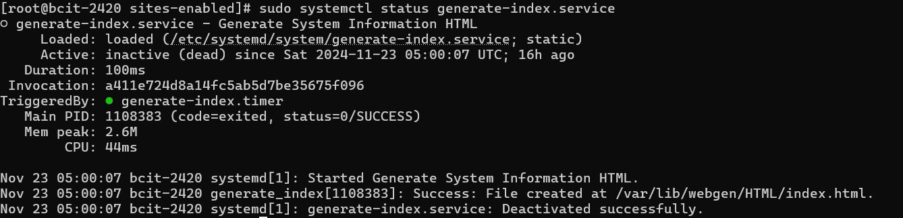
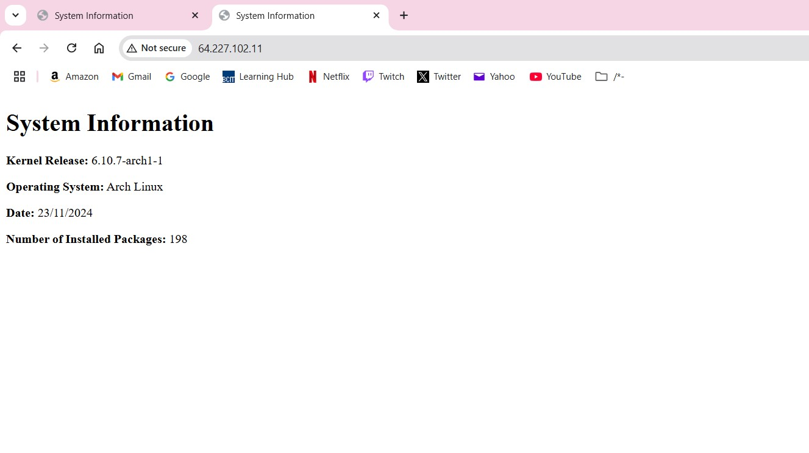

Task 1: Create System User `webgen`  
1. **Steps** : 
  - Create the system user with home directory and non-login shell:

```bash
sudo useradd -r -m -d /var/lib/webgen -s /usr/sbin/nologin webgen
```
 
  - Ensure the bin and HTML directory structure exists:

```bash
sudo mkdir -p /var/lib/webgen/bin /var/lib/webgen/HTML
```
 
  - Create the `generate_index` script in `/var/lib/webgen/bin/`:

```bash
sudo touch /var/lib/webgen/bin/generate_index /var/lib/webgen/HTML/index.html
```
 
  - Set ownership of both files to the webgen user of the webgen group:

```bash
sudo chown -R webgen:webgen /var/lib/webgen
```
 
2. **Why use a system user?** 
  - Enhances security by limiting permissions.
 
  - Reduces risks compared to using `root` or a regular user.


---

Task 2: Configure `generate-index.service` and `generate-index.timer` 
1. **Service File (`/etc/systemd/system/generate-index.service`)** :

```ini
[Unit]
Description=Generate system information HTML
After=network-online.target
Wants=network-online.target

[Service]
User=webgen
Group=webgen
ExecStart=/var/lib/webgen/bin/generate_index

[Install]
WantedBy=multi-user.target
```
 
2. **Timer File (`/etc/systemd/system/generate-index.timer`)** :

```ini
[Unit]
Description=Run generate-index.service daily at 05:00

[Timer]
OnCalendar=*-*-* 05:00:00
Persistent=true

[Install]
WantedBy=timers.target
```
 
3. **Commands to Enable and Verify** : 
 - Reload systemd daemon to recognize new files
```bash
sudo systemctl daemon-reload
```
  - Enable and start the timer:
  
```bash
sudo systemctl enable generate-index.timer
sudo systemctl start generate_index.timer
```
 
  - Verify timer status:

```bash
sudo systemctl status generate-index.timer
```
 
  - Check logs for service execution:

```bash
sudo journalctl -u generate-index.service
```


---

**Task 3: Configure nginx**  
1. **Update Main `nginx.conf`** : 
  - Edit `/etc/nginx/nginx.conf`:
  - Change the top #user
```nginx
user webgen;
```
 
2. **Server Block File (`/etc/nginx/sites-available/webgen`)** :

```ini
server {
    listen 80;
    server_name _;

    root /var/lib/webgen/HTML;
    index index.html;

    location / {
        try_files $uri $uri/ =404;
    }
}
```
 3. **Create new directories** :

```bash
mkdir /etc/nginx/sites-available
mkdir /etc/nginx/sites-enabled
```
4. **Enable the Server Block with symlink** :

```bash
sudo ln -s /etc/nginx/sites-available/webgen /etc/nginx/sites-enabled/webgen
```
 
5. **Restart nginx** :

```bash
sudo systemctl restart nginx
sudo systemctl status nginx
```
6. **Ensure permissions**
```bash
sudo chown -R webgen:webgen /var/lib/webgen
sudo chmod -R 755 /var/lib/webgen
```
7. **Why use a separate server block?**  
  - Keeps the main `nginx.conf` cleaner and easier to maintain.

  - Allows enabling/disabling individual sites.

---

**Task 4: Configure ufw**  
1. **Commands to Install and Configure ufw** :

```bash
sudo pacman -S ufw
sudo ufw allow ssh
sudo ufw allow http
sudo ufw limit ssh
sudo ufw allow 80
sudo ufw enable
```
 
2. **Check Firewall Status** :

```bash
sudo ufw status verbose
```

---

**Task 5: Validate the Setup**  
1. Visit the droplet's IP address in a browser: 
  - URL: `http://64.227.102.11`
 


---

Enhancing `generate_index` Script**  
1. Additional Information to Include:
 
  - CPU load (from `uptime`).
 
  - Disk usage (from `df`).
 
  - Active processes (from `ps`).
 
2. Improved Error Handling:

  - Verify permissions and required files before execution.

  - Log errors to a file for debugging.